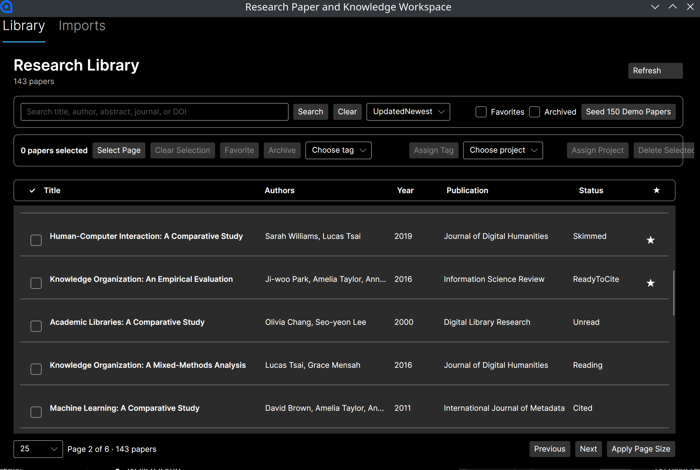

# Research Paper & Knowledge Workspace 📚🌐

**Clean Architecture Desktop workstation for Academic Literature Management & Knowledge Graphs**

A professional academic assistant application designed to import, organize, annotate, and link research papers in a unified database workspace. Built using C# .NET 9.0, Avalonia UI, and Entity Framework Core with SQLite, it empowers researchers to structure their literature reviews, capture annotations using markdown, and map complex citation/relationship graphs.


## 🖼️ System Showcase



## 🏆 Portfolio Significance & Outcomes

This project demonstrates clean coding practices and professional software design patterns:
- **Clean Architecture Implementation**: Strict division of concerns between Core (Entities, Enums, Value Objects, interfaces), Application (use cases, services, DTOs), Infrastructure (EF Core repositories, local storage, DB initialization), and App (Avalonia UI Views, ViewModels, assets).
- **Entity Framework Core with SQLite**: Implements repository pattern (`EfPaperRepository`, `EfResearchCatalogRepository`) mapped via Entity Framework Core to manage complex relational structures such as self-referencing paper relations, tag lists, authors, and notes.
- **Modern Desktop UI Layout**: Utilizes Avalonia UI 11 to deliver a modern, performant, and cross-platform XAML experience with split panes, responsive layouts, data binding, and asynchronous loading.
- **Knowledge Mapping Capability**: Implements directional paper-to-paper links with custom relationship types (e.g., references, builds-on, contradicts) enabling visualization and traversal of literature trees.

## ✨ Features

### 📂 Literature & Paper Management
- **Detailed Bibliographic Records**: Store full metadata including title, subtitle, journal, publisher, conference, volume, DOI, ISSN, ISBN, URL, and page ranges.
- **Reading Progress Tracker**: Classify papers as Unread, Reading, Read, or Reviewing. Add custom ratings and priority weights (0 to 5).
- **Tagging and Classification**: Tag papers with dynamic categories for quick organization.

### 💼 Research Project Workspace
- **Scoped Research Projects**: Group papers into project folders (workspaces) to segment different study topics or publications.
- **Favorites & Archive**: Mark key papers as favorites or archive completed references to keep the active library clean.

### 📝 Markdown Annotations & Attachments
- **Per-paper Notes**: Write detailed notes, summaries, or quotes for each paper using a rich Markdown editor structure.
- **File Attachments**: Link PDF documents, presentation slides, or source code directories directly to paper records.

### 🔗 Semantic Literature Graph
- **Inter-paper Relationships**: Graph connections between papers (e.g., *Paper A* is referenced by, contradicts, or builds upon *Paper B*).
- **Confidence Metrics**: Support confidence ratings for relationships, crucial for automated parsing pipelines.

### 📥 Import Pipeline
- **Import Workspaces**: Batch import bibliographical documents or PDFs with active progress tracking.

## 🛠️ Tech Stack

- **Development Framework**: C# .NET 9.0
- **UI Framework**: Avalonia UI 11 (XAML-based, cross-platform UI)
- **Object Relational Mapper**: Entity Framework Core 9.0
- **Database**: SQLite (local serverless database)
- **Architecture Pattern**: Clean Architecture + MVVM (Model-View-ViewModel)

## 📁 Project Structure

```
research-paper-and-knowledge-workspace/
├── ResearchPaperKnowledgeWorkspace.sln  # .NET solution file
├── README.md                            # Project documentation
├── data/
│   └── Screenshot.png                   # Embedded system screenshot
├── src/
│   ├── ResearchPaperKnowledgeWorkspace.Core/           # Domain Layer (Core Entities & Interfaces)
│   │   ├── Common/                                     # Base Entity definitions
│   │   ├── Entities/                                   # Paper, Author, Tag, Note, Attachment, Project, etc.
│   │   └── Interfaces/                                 # Repository and service abstractions
│   │
│   ├── ResearchPaperKnowledgeWorkspace.Application/    # Application Layer (Core Logic & Use Cases)
│   │   ├── Abstractions/                               # Interfaces for services
│   │   ├── Imports/                                    # Import orchestrators
│   │   └── Papers/                                     # Paper retrieval and updating commands
│   │
│   ├── ResearchPaperKnowledgeWorkspace.Infrastructure/ # Infrastructure Layer (Data & Storage Implementation)
│   │   ├── Data/                                       # EF Core DB context, migrations, migrations seeding
│   │   │   └── Migrations/                             # Auto-generated schema changes
│   │   └── Repositories/                               # EfPaperRepository, EfResearchCatalogRepository
│   │
│   └── ResearchPaperKnowledgeWorkspace.App/            # Presentation Layer (XAML Views & MVVM ViewModels)
│       ├── Views/                                      # LibraryView, ImportWorkspaceView, PaperOrganizationView
│       ├── ViewModels/                                 # LibraryViewModel, MainWindowViewModel
│       └── Assets/                                     # Application icons, stylesheets, assets
│
└── tests/                                              # Test Suites (xUnit framework)
```

## 🚀 Quick Start

### Prerequisites
- [.NET 9.0 SDK](https://dotnet.microsoft.com/download/dotnet/9.0)

### Run from Source

```bash
# Clone the repository
git clone https://github.com/yourusername/research-paper-and-knowledge-workspace.git
cd research-paper-and-knowledge-workspace

# Restore project dependencies
dotnet restore

# Build the project
dotnet build

# Launch the application
dotnet run --project src/ResearchPaperKnowledgeWorkspace.App
```

## 📖 Usage Guide

### 1. Catalog Your Papers
- Open the application.
- In the **Library View**, click **Add Paper** to manually key in a paper details (Title, DOI, Authors) or use the **Imports** tab to process bibliographic files.

### 2. Take Structured Notes
- Click on any paper in the grid list.
- Navigate to the **Notes** section to add a new Markdown-supported note where you can summarize results, compile definitions, and keep notes pinned for quick retrieval.

### 3. Establish Knowledge Relationships
- In the detail sidebar of a paper, choose **Add Relationship**.
- Select a target paper from your catalog and assign a connection type (e.g. `References`, `BuildsOn`, `Contradicts`, `Related`) to construct a comprehensive network graph of your library.

### 4. Group by Project Workspaces
- Go to the **Projects** panel.
- Create a project (e.g., "Deep Learning Survey 2026").
- Assign relevant paper records to keep research streams organized.

## 📄 License

This project is licensed under the MIT License - see the [LICENSE](LICENSE) file for details.
